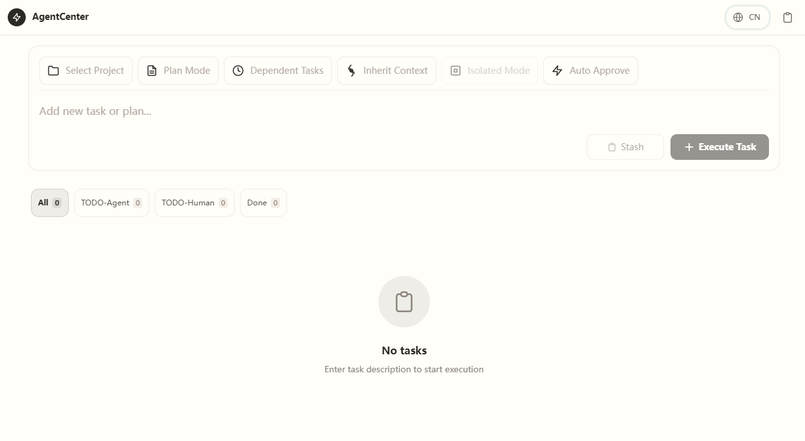
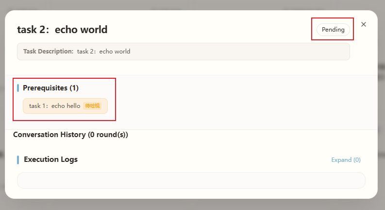
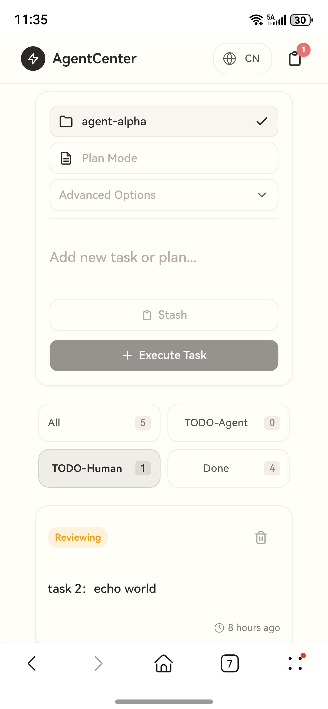
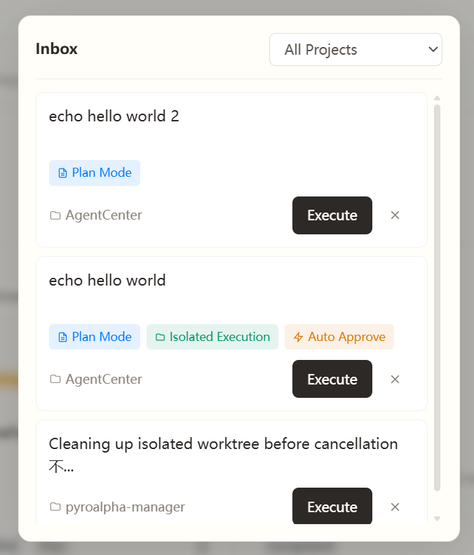

**🌐 Select Language / 选择语言:**
[English](README.en.md) | [简体中文](README.md)

---

# AgentCenter

**When you have multiple Agents executing different tasks, you need a command center.**

AgentCenter provides **task status visualization, dependency orchestration, and execution isolation** — so you can see at a glance what all Agents are doing, automatically handle dependency triggers and parallel isolation. You only make decisions at key nodes.

> Currently supports **Claude Code CLI**, with more Agents coming soon

<div align="center">
  
  <br/>
  <small>Figure: AgentCenter Main Interface - Task management and Agent status panel</small>
</div>

---

## Quick Start

### Local Deployment (Recommended)

**Prerequisites**: Install Node.js, uv, and Claude Code CLI first. See [Full Deployment Guide](#full-deployment-guide) for details.

```bash
# 1. Clone the repository
git clone git@github.com:pyroalpha/agent-center.git
cd agent-center

# 2. Install project dependencies (one-time)
npm run setup

# 3. Configure environment variables (required)
cp backend/.env.example backend/.env
# Edit backend/.env, set PASSWORD=strong_password

# 4. Start development server
npm run dev
```

Access http://localhost:3010

> **Having issues?** For troubleshooting or detailed steps, see [Full Deployment Guide](#full-deployment-guide)

### Docker Deployment (Optional)

```bash
# 1. Create configuration directories
mkdir -p ~/agent-center/{data,config,workspace}

# 2. Copy configuration files
cp backend/.env.example ~/agent-center/config/.env
cp ~/.claude/settings.json ~/agent-center/config/settings.json

# 3. Edit configuration (required)
# - Edit ~/agent-center/config/.env, set PASSWORD=strong_password

# 4. Start
docker-compose up -d
```

Access http://localhost:3010

> **Need configuration?** See [FAQ - Docker Runtime Configuration](#docker-runtime-configuration)

---

## Core Features

| Feature | What It Does for You |
|---------|---------------------|
| **Dependency Orchestration** | Set task dependencies; subsequent tasks auto-trigger when prerequisites complete, no manual watching needed |
| **Pending Review Management** | When multi-project multi-Agent running in parallel, only shows tasks needing your decision; the rest evolve on their own |
| **Parallel Isolation** | Each task executes in independent worktree, code never interferes, auto-merge and cleanup |
| **Context Reuse** | Continue execution based on complete session history from previous tasks; Agent knows what happened before |
| **Plan Mode** | For large refactoring, output execution plan first; approve before acting to avoid rework |
| **Mobile Friendly** | Responsive design, check progress, approve plans, and record ideas from your phone anytime |

---

## Typical Scenarios

### Scenario 1: A Chain of Tasks, Let It Run Automatically

> Best for: Refactoring + doc updates, multi-step migrations, and other tasks that need sequential execution

<div align="center">
  
  <br/>
  <small>Figure: Dependency Orchestration - Task A completion auto-triggers Task B</small>
</div>

**Steps:**
1. Create Task A "Refactor Payment Module"
2. Create Task B "Add Payment Logs", set dependency on Task A
3. When Task A completes, Task B starts automatically

---

### Scenario 2: Multi-Project Parallel, Only Focus on What Needs Your Decision

> Best for: Developing multiple features simultaneously, each with multiple tasks

<div align="center">
  
  <br/>
  <small>Figure: Pending Review Management - Only shows tasks needing your intervention</small>
</div>

**Steps:**
1. Create tasks for each project, check "Isolated Execution"
2. Switch to "TODO-Human" filter
3. Only handle tasks needing your approval or review

---

### Scenario 3: Inspiration Strikes, Record in 10 Seconds

> Best for: Sudden ideas when you don't want to interrupt current work

<div align="center">
  
  <br/>
  <small>Figure: Inbox - Record ideas anytime, anywhere</small>
</div>

**Steps:**
1. Access Inbox page from mobile
2. Click "Save", enter your idea
3. When free, convert Inbox item to task with one click

---

## Deployment Options

| Method | Best For |
|--------|----------|
| **Local Deployment** | Personal development, quick start |
| **Docker Deployment** | Production environment, team collaboration |

### Local Deployment

```bash
npm run setup
npm run dev
```

### Docker Deployment

```bash
# 1. Create configuration directories
mkdir -p ~/agent-center/{data,config,workspace}

# 2. Copy configuration files
cp backend/.env.example ~/agent-center/config/.env
cp ~/.claude/settings.json ~/agent-center/config/settings.json

# 3. Edit configuration (optional)
# - Edit ~/agent-center/config/.env to set password and other settings

# 4. Start
docker-compose up -d
```

> **Need detailed steps?** See [Full Deployment Guide](#full-deployment-guide)
>
> **Having issues?** See [FAQ](#faq)

---

## Architecture Overview

<details>
<summary>View Architecture Overview (Optional)</summary>

```
┌─────────────────────────────────────────────────────┐
│                  Frontend (Next.js 14)                │
│  ┌─────────┐  ┌─────────┐  ┌─────────┐  ┌─────────┐ │
│  │TaskInput│  │UnifiedList│  │TaskDrawer│  │PlanDrawer│ │
│  │(Config) │  │(TaskCard) │  │(LogStream)│ │(PlanApproval)│ │
│  └─────────┘  └─────────┘  └─────────┘  └─────────┘ │
└─────────────────────┬───────────────────────────────┘
                      │ HTTP (REST) + WebSocket (Logs)
┌─────────────────────▼───────────────────────────────┐
│                  Backend (FastAPI)                    │
│  ┌─────────────────────────────────────────────────┐│
│  │            Ralph Loop Scheduler                  ││
│  │  Scan every 5s → Check dependencies → Assign    ││
│  │  Worker → Monitor execution                      ││
│  └─────────────────────────────────────────────────┘│
│  ┌─────────────────┐  ┌─────────────────────────┐   │
│  │ Worktree Service│  │ Runner Service (Agent Executor)││
│  │ Git Isolation   │  │ --fork-session          │   │
│  │ Create/Merge/   │  │ --resume                │   │
│  │ Cleanup         │  │ --add-dir               │   │
│  │                 │  │ --permission-mode       │   │
│  └─────────────────┘  └─────────────────────────┘   │
└─────────────────────┬───────────────────────────────┘
                      │
┌─────────────────────▼───────────────────────────────┐
│SQLite (WAL Mode) + Agent Executor (Current: Claude Code CLI)│
└─────────────────────────────────────────────────────┘
```

**Core Data Flow:**

```
1. User creates task → POST /api/tasks
2. Task saved to database → Status: queued
3. Ralph Loop polls → Check dependencies → Assign Worker
4. Runner service starts Agent Executor → Status: running
5. Logs pushed via WebSocket → Frontend displays in real-time
6. Task complete → Status: completed / reviewing
7. Isolated task → Auto merge + cleanup worktree
```

</details>

---

## Project Structure

<details>
<summary>View Project Structure (Optional)</summary>

```
agent-center/
├── backend/
│   ├── app.py                 # FastAPI entry
│   ├── auth.py                # Session management
│   ├── config.py              # Configuration management
│   ├── db.py                  # Database connection
│   ├── middleware/            # Authentication middleware
│   ├── routes/                # API routes (tasks, inbox, projects, auth...)
│   ├── scheduler/             # Ralph Loop scheduler
│   ├── services/              # Core services (task, runner, worktree, dependency...)
│   └── utils/                 # Utility functions
│
├── frontend/
│   ├── app/                   # Next.js pages and layout
│   ├── components/            # UI components, lists, drawers
│   ├── lib/                   # API clients, Hooks, state management
│   ├── types/                 # TypeScript type definitions
│   └── middleware.ts          # Next.js middleware
│
├── docs/                      # Architecture and authentication design docs
└── docker-compose.yml         # Docker deployment configuration
```

</details>

---

## Full Deployment Guide

<details>
<summary>View Full Deployment Guide</summary>

### Prerequisites

AgentCenter is built on **Claude Code CLI**, please ensure the following dependencies are installed:

**1. Install Claude Code CLI (Required)**

```bash
npm install -g @anthropic-ai/claude-code

# Verify installation
claude --version
```

**2. Node.js 18+**

Frontend is based on Next.js 14, requires Node.js 18 or higher.

```bash
# Verify installation
node --version
```

**3. Python 3.10+ and uv**

Backend is based on FastAPI, requires Python 3.10 or higher and `uv` package manager.

```bash
# Install uv (recommended)
curl -LsSf https://astral.sh/uv/install.sh | sh   # macOS/Linux
powershell -c "irm https://astral.sh/uv/install.ps1 | iex"  # Windows

# Verify installation
uv --version
```

### Configure Environment Variables

Backend only:

```bash
cp backend/.env.example backend/.env
# Edit backend/.env, set PASSWORD=strong_password (required!)
```

> **Frontend requires no configuration** — automatically infers backend API and WebSocket from access URL (port `:3010` → `:8010`), works on mobile too.

### Separate Start (Optional)

If you need to control frontend and backend in separate terminal windows:

```bash
# Terminal 1 - Backend
cd backend
uv sync
uvicorn app:app --host 0.0.0.0 --port 8010

# Terminal 2 - Frontend
cd frontend
npm install
npm run dev    # http://localhost:3010
```

Log output example:
```
[BACKEND] INFO:     Uvicorn running on http://0.0.0.0:8010
[FRONTEND] ready - started server on 0.0.0.0:3010
```

> **Tip**: Press `Ctrl+C` to stop both frontend and backend simultaneously.

### Docker Runtime Configuration

Optional: specify backend address at runtime:

```bash
# Build universal image
docker build -t agent-center:latest -f frontend/Dockerfile .

# Specify backend address (optional, auto-infers if omitted)
docker run -d --name ac-frontend \
  -p 3010:3010 \
  -e API_DOMAIN=http://backend:8010 \
  -e WS_DOMAIN=ws://backend:8010 \
  agent-center:latest
```

> **Tip**: Without environment variables, frontend auto-infers backend from browser URL (e.g., `http://192.168.1.100:3010` → backend API `http://192.168.1.100:8010`).

</details>

---

## FAQ

<details>
<summary>View FAQ</summary>

### ⚠️ Security Warning

**You MUST set `PASSWORD` after deployment!**

If password is not set, anyone who knows your device IP can:
- View all tasks and execution logs (may contain API Keys, code, and other sensitive information)
- Execute arbitrary Claude Code commands in your name
- Delete tasks and modify configurations

**Correct approach:**
```bash
# backend/.env
PASSWORD=strong_password (at least 12 characters, including uppercase, lowercase, numbers, and symbols)
```

**Backend listening:**

Backend listens on `0.0.0.0` by default, allowing LAN access. On startup, it automatically adds the local IP to the CORS allowlist, so mobile access works without extra configuration.

### Network Access Configuration

After starting the service, you can access via:

| Device | Address |
|--------|---------|
| Local Browser | `http://localhost:3010` or `http://<local-IP>:3010` |
| Mobile/Tablet | `http://<local-IP>:3010` |
| LAN Devices | `http://<local-IP>:3010` |

**Get Local IP:**

```bash
# Windows
ipconfig | findstr "IPv4"

# Linux
hostname -I | awk '{print $1}'

# macOS
ipconfig getifaddr en0
```

Backend will automatically print local IP address on startup:
```
Access URLs:
  Local:   http://localhost:8010
  Network: http://192.168.1.100:8010
```

**Q: Phone cannot access?**

1. Confirm phone and computer are on the same WiFi network
2. Check firewall allows ports 8010 (backend) and 3010 (frontend)
3. Backend listens on `0.0.0.0` by default (already supports mobile)
4. Frontend auto-adapts, no extra configuration needed

### Firewall Configuration

**Windows Firewall**

Run PowerShell as Administrator:
```powershell
# Open backend port 8010
netsh advfirewall firewall add rule name="AgentCenter Backend" dir=in action=allow protocol=TCP localport=8010

# Open frontend port 3010
netsh advfirewall firewall add rule name="AgentCenter Frontend" dir=in action=allow protocol=TCP localport=3010
```

**Linux Firewall**

```bash
# Ubuntu/Debian (UFW)
sudo ufw allow 8010/tcp
sudo ufw allow 3010/tcp

# CentOS/RHEL (firewalld)
sudo firewall-cmd --permanent --add-port=8010/tcp
sudo firewall-cmd --permanent --add-port=3010/tcp
sudo firewall-cmd --reload
```

> **Note**: `0.0.0.0` listening will expose to LAN, make sure to use in trusted networks.
> Production environment should use reverse proxy (Nginx/Caddy) and configure HTTPS.

</details>

---

## Learn More

- [Architecture Design Docs](docs/architecture.md)

---

## Known Limitations

| Limitation | Impact | Workaround |
|------------|--------|------------|
| In-memory Session | Need to re-login after service restart | Sufficient for personal use |
| Single User | No multi-user/permission management | Personal project, no multi-user needed |
| SQLite | Limited high-concurrency writes | Sufficient for personal use |
| Worktree Auto-Merge/Cleanup | Occasionally Agent may not complete merge or cleanup properly, requiring manual intervention | Review task status, manually execute git commands to complete merge or cleanup |

---

## License

MIT
